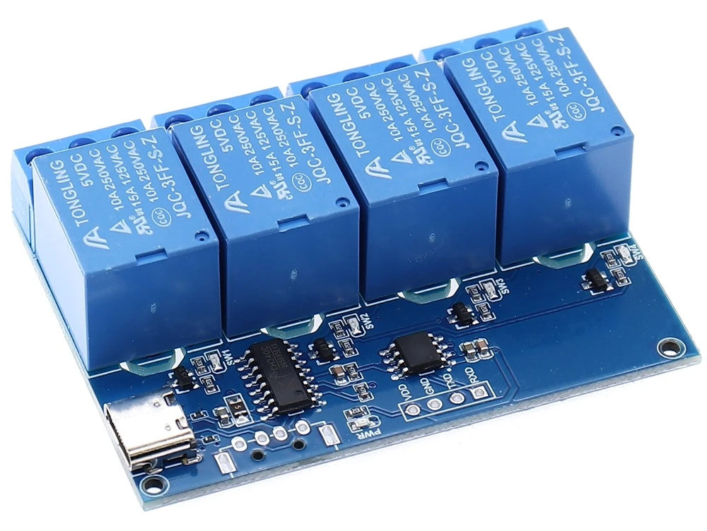

# USB relay control

## About HW

Chinese USB 1/2/4-channel relay modules Type-C.

Keywords: Samirob, LCUS-1/2/4



## Quick start

```python
from usb_relay import usb_relay

# open serial port
r = usb_relay("/dev/ttyUSB0")

# open 1st relay
r.open(1)

# close 2nd relay
r.close(2)

# switch 3rd relay
r.switch(3)

# show status of 2nd relay (0 - closed, 1 - opened)
print(r.status(2))
```

## Protocol/methods descriptions

```python
from usb_relay import usb_relay
help(usb_relay)

...

Help on class usb_relay in module usb_relay:

class usb_relay(builtins.object)
 |  usb_relay(serial_port, keep_open=False)
 |  
 |  ---
 |  Serial port exchange protocol with USB relay:
 |  
 |  Request: 4 bytes length.
 |  Reply: 4 bytes.
 |  Message format: start_symbol, port_number, command, check_sum
 |  Start symbol = 0xa0
 |  Port number starts since 1
 |  Commands: 0 = close (quiet),
 |            1 = open (quiet),
 |            2 = close (with previous port status reply),
 |            3 = open (same as above),
 |            4 = switch (same as above),
 |            5 = request port status (reply current port status)
 |  Checksum: 0xa0 + port_number + command.
 |  ---
 |  
```

## C version

There is C-only version of control soft in folder "c"
